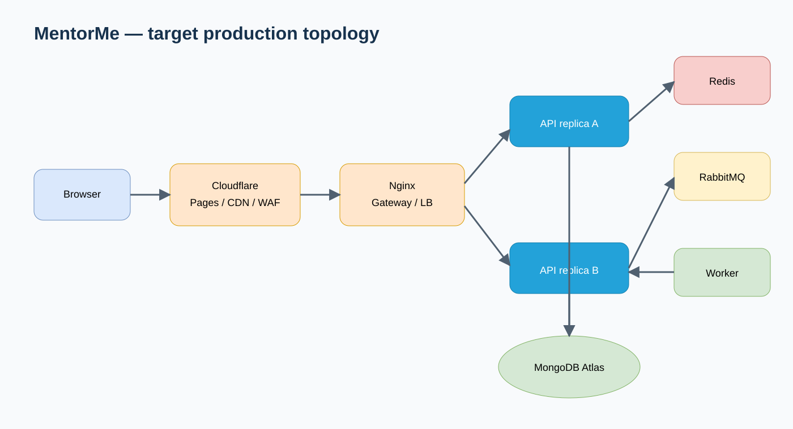

<div align="center">

# MentorMe

### Find the right mentor. Build momentum. Grow with confidence.

A full-stack mentoring platform for mentor discovery, consultation booking, learning commerce, and real-time collaboration.

<p>
  <strong>English</strong>
  ·
  <a href="README-VI.md">Tiếng Việt</a>
</p>

<p>
  
  
  
  
  
  
</p>

<p>
  <a href="https://github.com/kaing615/MentorMe/actions/workflows/backend.yml"></a>
  <a href="https://github.com/kaing615/MentorMe/actions/workflows/frontend.yml"></a>
</p>

[Product](#product-capabilities) · [Architecture](#system-architecture) · [Tech stack](#technology-stack) · [Quick start](#quick-start) · [Documentation](#documentation)

</div>

---

## Overview

MentorMe brings the essential parts of a mentoring journey into one cohesive product. Learners can discover mentors, request consultations, purchase courses, exchange messages, and leave reviews. Mentors can present their expertise, manage availability, respond to bookings, publish learning content, and communicate with mentees.

Beyond product features, the repository demonstrates a pragmatic evolution from a collaborative application into a production-oriented system with explicit decisions around consistency, scalability, security, reliability, observability, and delivery.

> **Project status:** the application and production automation are implemented and locally verified. Public deployment and measured-scale claims remain intentionally excluded until the documented external drills are completed.

## Product capabilities

| Discover and connect | Schedule consultations |
| --- | --- |
| Create mentor or mentee profiles<br>Search mentors by expertise<br>View detailed mentor information<br>Apply to become a mentor | Publish timezone-aware availability<br>Request an available time slot<br>Confirm, decline, or cancel bookings<br>Track consultation history |
| **Learn and transact** | **Communicate and get support** |
| Browse courses and course details<br>Manage cart and wishlist<br>Create orders and supported checkout flows<br>Review courses and consultations | Exchange authenticated real-time messages<br>Track delivery and read state<br>Receive in-app notifications<br>Submit and manage help requests |

## System architecture

MentorMe follows a **scaled modular-monolith** design. Domain logic stays in one cohesive API codebase, while stateless replicas, shared infrastructure, and background workers create a practical scaling path without premature microservice complexity.

<p align="center">
  
</p>

```text
Browser
  │
  ▼
Cloudflare Pages / CDN
  │
  ▼
Nginx API gateway and load balancer
  ├── Express API slot A ─┐
  └── Express API slot B ─┼── MongoDB Atlas
                          ├── Redis
                          └── Transactional outbox → RabbitMQ → Worker
```

The complete design package includes editable Draw.io sources, C4 and UML views, architectural decision records, consistency and security analysis, quality attributes, testing strategy, operational runbooks, and implementation traceability.

## Engineering highlights

| Quality | Implementation |
| --- | --- |
| **Consistency** | MongoDB transactions, guarded booking/payment state machines, durable idempotency, and a transactional outbox |
| **Scalability** | Two stateless API slots, Nginx load balancing, Redis cache versioning, distributed rate limits/locks, and Socket.IO fan-out |
| **Reliability** | Publisher confirms, consumer deduplication, bounded retries, dead-letter routing, health gates, graceful shutdown, and rollback automation |
| **Security** | Short-lived access JWTs, rotating opaque refresh tokens, reuse-family revocation, secure cookies, NoSQL operator rejection, and upload restrictions |
| **Observability** | Structured logs, request IDs, W3C trace propagation, Prometheus metrics, health endpoints, and reproducible k6 profiles |
| **Delivery** | GitHub Actions, immutable Git-SHA images, protected production approvals, two-slot rolling updates, smoke checks, and SHA rollback |

## Technology stack

| Layer | Technologies |
| --- | --- |
| **Web application** | React 19, Vite 6, React Router, Redux Toolkit, TanStack Query, MUI, Ant Design, Tailwind CSS |
| **API** | Node.js 22, Express 5, Mongoose 8, REST, Swagger/OpenAPI |
| **Realtime** | Socket.IO, Redis adapter, authenticated WebSocket connections |
| **Data and events** | MongoDB, Redis, RabbitMQ |
| **Infrastructure** | Docker, Docker Compose, Nginx, Cloudflare Pages/CDN, MongoDB Atlas |
| **Quality and operations** | Node test runner, Pino, Prometheus client, k6, actionlint, GitHub Actions, GHCR |

## Quick start

### Prerequisites

- Node.js 22 and npm
- A local MongoDB instance or MongoDB connection string
- Docker and Docker Compose for the containerized workflow

Redis and RabbitMQ are optional during local development and disabled by default in the example environment.

### Local development

1. Clone the repository.

   ```bash
   git clone https://github.com/kaing615/MentorMe.git
   cd MentorMe
   ```

2. Configure and start the API.

   ```bash
   cd backend
   cp .env.example .env
   npm ci
   npm run dev
   ```

3. In another terminal, configure and start the web application.

   ```bash
   cd frontend
   cp .env.example .env
   npm ci
   npm run dev
   ```

Replace the example JWT and metrics secrets in `backend/.env` before starting the API. Email, media, and payment credentials are only required when using their corresponding integrations.

### Docker Compose

```bash
cp backend/.env.example backend/.env
docker compose up --build
```

| Service | Local URL |
| --- | --- |
| Web application | `http://localhost:5173` — local / `http://localhost:3000` — Docker |
| REST API | `http://localhost:4000` |
| Swagger UI | `http://localhost:4000/api-docs` |
| Liveness probe | `http://localhost:4000/health/live` |

## Repository structure

```text
MentorMe/
├── backend/                 Express API, domain modules, worker, and tests
├── frontend/                React application and frontend tests
├── deploy/                  Production Compose, Nginx, telemetry, and scripts
├── docs/
│   ├── adr/                 Architectural decision records
│   ├── diagrams/            Editable Draw.io files and SVG exports
│   └── system-design/       Architecture, security, testing, and runbooks
├── load-tests/              k6 HTTP and WebSocket profiles
├── scripts/                 Documentation and diagram verification
├── tests/deploy/            Deployment topology and behavior tests
├── .github/workflows/       CI and production delivery pipelines
└── docker-compose.yml       Local development stack
```

## Quality and verification

Run the core CI checks locally:

```bash
cd backend
npm test

cd ../frontend
npm test
npm run lint:ci
npm run build

cd ..
node scripts/verify-docs.mjs
node scripts/validate-drawio.mjs
node tests/deploy/compose.test.mjs
node tests/deploy/deploy-script.test.mjs
```

`lint:ci` enforces the committed legacy-debt ceiling. It prevents new regressions while the remaining frontend lint debt is reduced incrementally.

## Production delivery

Production assets live in [`deploy/`](deploy). The delivery workflow builds an immutable backend image tagged with the full Git SHA, publishes it to GHCR, deploys one API slot at a time, waits for readiness, validates and reloads Nginx, runs smoke checks, and restores the previous SHA when a health gate fails.

Follow the [operations runbook](docs/system-design/operations-runbook.md) to configure the host, protected GitHub Environment, deployment secrets, rollback process, and recovery procedures.

> MentorMe does not claim a public production deployment or measured throughput until the external drills in the [portfolio evidence](docs/system-design/portfolio-evidence.md) are completed against an immutable release.

## Documentation

| Topic | Reference |
| --- | --- |
| Architecture index | [System design overview](docs/system-design/README.md) |
| Production architecture | [Approved production design](docs/system-design/production-system-design.md) |
| Consistency and events | [Event architecture](docs/system-design/consistency-and-events.md) |
| Security | [Security model](docs/system-design/security.md) |
| Testing | [Testing strategy](docs/system-design/testing-strategy.md) |
| Operations | [Production runbook](docs/system-design/operations-runbook.md) |
| Verified claims | [Portfolio evidence](docs/system-design/portfolio-evidence.md) |
| Open work | [Known technical debt](docs/system-design/known-debt.md) |

## Contribution workflow

```text
feature/* → stage → main
```

1. Create a focused feature or fix branch.
2. Use Conventional Commits for each logical change.
3. Open a pull request into `stage` for integration testing and review.
4. Promote the verified `stage` branch to `main` through a reviewed pull request.
5. Never push directly to `main`.

```text
<type>(<scope>): <short description>

feat(booking): add consultation availability workflow
fix(auth): reject refresh token family reuse
docs(architecture): document outbox delivery guarantees
test(payment): cover idempotent checkout retries
```

## Contributors

| Name | Role |
| --- | --- |
| **Nguyễn Đình Tâm** | Team Lead · DevOps · Backend |
| Văn Công Khoa | Backend · Frontend |
| Trần Minh Quang | Frontend |
| Nguyễn Phước Quý Bảo | Backend · Frontend |
| Đỗ Đăng Khoa | Backend · Frontend |
| Phạm Đăng Khoa | Frontend |
| Huỳnh Lê Đại Thắng | DevOps · Backend |

---

<p align="center">
  Built as a collaborative engineering project with a focus on practical product delivery and production-minded system design.
</p>
